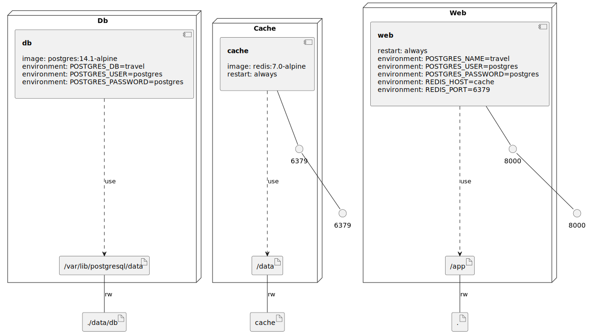

# TravelAndLogistic
An API for Travel Ticket Management created with Django Rest Framework, Djoser and Flutterwave and DRF-YASG. It allows authenticated user to book and pay for ticket 
for already defined Traveling Company. I used Djoser Framework for Authentication System and Flutterwave for Payment Gateway and Drf-yasg for swagger documentation.

Like any management system, the set of operations that can be performed depends on their parmission level. The users are grouped into two, The admin and general users.
The admin user can:<br>
 1. Create a Transport Company
 2. Create a new Car park
 3. Create price for traveling from one location to another for a perticular company.
 4. If he decides t use the service, He can also book and pay for ticket.
 
 The General User can:
 1. Book a traveling ticket
 2. Pay for the ticket

# Live Link
This project is live at [GoWithEase](gowithease.herokuapp.com)

# Features

1. Robust Authentication System created with Djoser
2. OTP verification with Termi
3. Payment Gateway using Flutterwave
4. Documented with Swagger


# TO DO

1. Refactor Code
2. Add more documentation


# Documentation Guild To Use

Most of the endpoints are authentication protected. To test the endpoints, You can either use the browsable API or The Swagger Documentation.

To use the Browsable API which uses Session Authentication, You can create an account or use the test account below to login:

```
username: haryourjb3@gmail.com
password: 12345
```

To use the Swagger documentation page which uses JWT authentication:

You can choose to use the account detail above or ceate another account.

To use the account detail above, skip step 1 to 3, ELSE:

1. Create a new user with valid email using the `User Create Endpoint`
2. Check Email for Activation Code. It will be in the format `/activate/{UID}/{Token}`
3. Copy the UID and Token and activate your account with the User Activation Endpoint
4. Create a `JWT Access and Refresh` token with the `JWT Create Endpoint`
5. Copy the `JWT Access Token` 
6. Authorize yourself, Authorization token in the format `JWT {Jwt access token}`
7. You can use other endpoints now.

# Test Card Detail For Payment

```
card num: 4187 4274 15564246
valid thru: 09/32
cvv: 828
```


### Infrastructure model

- [web component model](.infragenie/web_component_model.svg)

---
